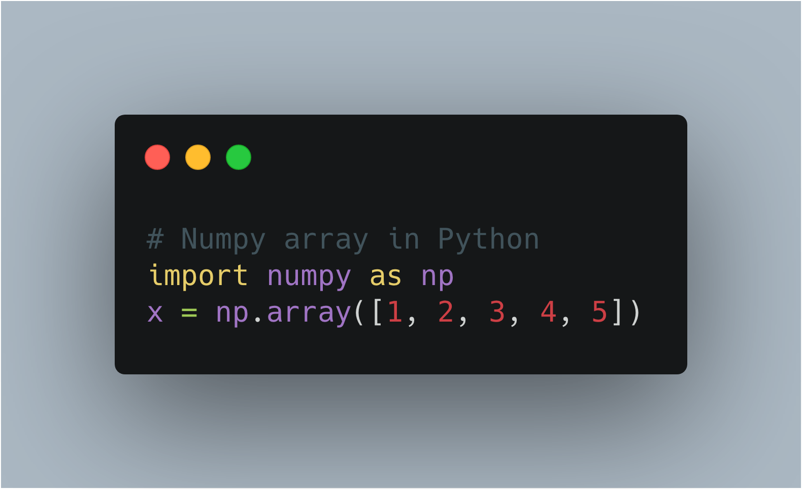
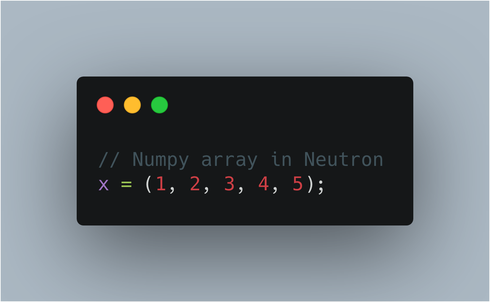

# Neutron

[](https://app.codacy.com/project/MonliH/neutron/dashboard)
[](https://neutron-lang.readthedocs.io/en/latest)
[](https://www.gnu.org/licenses/gpl-3.0.en.html)
[](https://paypal.me/MonLiH)
[](https://github.com/python/black)

**Neutron is a high level general-purpose programming language that is inspired by C, Python, and Java.**

<!---|  | 
|:--:|:--:|
| Numpy array in Python | Numpy array in **Neutron**-->

# Example
Here is how to do the guess the number game in neutron:

```java
get!("io/print");
get!("io/stdin");
get!("types/to_int");
get!("types/to_string");
get!("random/randrange");


is_not_win = true;
number = randrange(0, 100);
num_guesses = 0;

while (is_not_win) {
  guess = to_int(stdin(prompt="Enter A Number Between 0 and 100: "));
  if (guess == number) {
    print("You Win!");
    is_not_win = false;
  } else if (guess < number) {
    print("Too Low");
  } else if (guess > number) {
    print("Too High");
  }
}
```

# Documentation
**[There is a Readthedocs here](https://neutron-lang.readthedocs.io/en/latest/)** for full documentation and installation instructions. There is also a [Gitter Chat here](https://gitter.im/The-Neutron-Foundation).

# Dependencies
Before installing/building/running neutron, you should first install the dependencies. you can do this via `pip3` or any other package manager. The dependencies required are:

* [Numpy](https://www.numpy.org/)
* [SLY](https://github.com/dabeaz/sly)

# Basic Usage
To use, run the filename as the first argument. It is recommended to use the python interpreter to run the code (just run the `neutron` folder), like so:

```
python3 neutron path/to/neutron/file.ntn
```

The filename for neutron files is `.ntn`. For example, `important_file.ntn`. If you want to use the compiled binaries, on Unix-like systems, you could do:

```
./neutron.bin path/to/neutron/file.ntn
```

# Syntax Highlighting
Text Editor | Where to find
--- | ---
Atom | [Atom Package Repository (language-neutron)](https://atom.io/packages/language-neutron)

# Why Neutron?
- It's actively maintained
- It's a versatile programming language suited for many things
- New features are constantly being added

# Features
There are constantly new features being developed in neutron. To see the features that are coming and the one that are being worked on, go [**here**](https://github.com/orgs/the-neutron-foundation/projects).
- [x] **Numpy  arrays Builtin!!**
- [x] Classes
- [x] Functions
- [x] Built-Ins (e.g. print, get, stdin, to_int)
- [x] Primitive Types (Integers, Floats, Booleans, Strings)
- [x] Python Lists, Tuples and Numpy Arrays Builtin
- [x] While loops
- [x] For Loops
- [ ] C-like Structs
- [ ] Switch Statements
- [ ] Syntax Changeable at Runtime

# Tools used
- [Sly lex yacc](https://github.com/dabeaz/sly) used for parsing
- Python 3 (can be used with [CPython](https://www.python.org/downloads/), [Nuitka](https://nuitka.net/pages/overview.html>), or [PyPy](https://pypy.org/))
